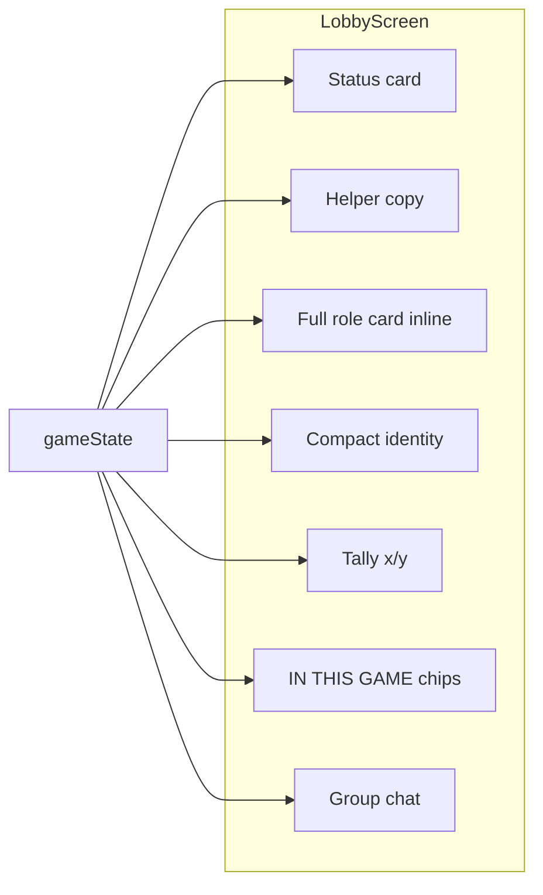

# Phase 1: Core Lobby & Role Acceptance Flow — Plan

## Current state (already implemented)

All five Phase 1 items are present in [apps/player/lib/screens/lobby_screen.dart](apps/player/lib/screens/lobby_screen.dart) and supporting widgets.

| Requirement                       | Implementation                                                                                                                                                                                                                                                                                                                                                                                                                    |
| --------------------------------- | --------------------------------------------------------------------------------------------------------------------------------------------------------------------------------------------------------------------------------------------------------------------------------------------------------------------------------------------------------------------------------------------------------------------------------- |
| **1. New Lobby Screen**           | Dedicated `LobbyScreen` with status card, identity block, roster, tally, and group chat. Title: "THE LOUNGE".                                                                                                                                                                                                                                                                                                                     |
| **2. Player Roster**              | "IN THIS GAME" row: horizontal chips (one per player). Chips show a check icon when that player has a role and has confirmed (`roleConfirmedPlayerIds`). Tapping opens a profile panel.                                                                                                                                                                                                                                           |
| **3. Guided Instructions**        | Phase-aware helper block under the status card: `_buildLobbyHelperCopy(phase, hasRole, isRoleConfirmed)` in a `CBGlassTile` (lobby/setup/has-role/confirmed copy).                                                                                                                                                                                                                                                                |
| **4. Role Reveal & Confirmation** | When `hasRole && !isRoleConfirmed`, the full character card is shown **inline** via [FullRoleRevealContent](apps/player/lib/widgets/full_role_reveal_content.dart) (avatar, dossier, tactical intel, mission, "ACKNOWLEDGE IDENTITY" button). The existing **modal** [RoleRevealScreen](apps/player/lib/screens/role_reveal_screen.dart) still opens on first role assign for drama; confirmation works in both modal and inline. |
| **5. Confirmation Tally**         | "ACKNOWLEDGED: x/y" plus optional "Waiting: Alice, Bob" in a `CBGlassTile`, driven by `_roleAcknowledgementTally(gameState)` (only counts players with an assigned role; excludes bots). Shown when `tally.total > 0`.                                                                                                                                                                                                            |

Data flow: `activeBridgeProvider` supplies `gameState` (phase, players, roleConfirmedPlayerIds, bulletin). No new APIs or state are required for Phase 1.

---

## Optional polish (if desired)

- **Room framing**: Add a one-line subtitle (e.g. "You're in the room — chat, wait for roles, then acknowledge.") or merge into the existing helper text.
- **Modal vs inline**: Currently both modal (first reveal) and inline card are shown. Optionally remove the automatic modal and rely only on the inline card for a single place to confirm.
- **Tally placement**: Tally is below identity/roster and above "ENCRYPTED CHANNEL". You could move it directly under the status card if you want it more prominent.

---

## Verification steps

1. Run the player app and join a game (QR → Connect/Claim → Lobby).
2. Confirm the lobby shows: status card, helper text, "IN THIS GAME" roster, and (when phase is setup and at least one role is assigned) the acknowledgement tally.
3. As host, assign roles; in the player app confirm the modal appears and the inline full character card appears with "ACKNOWLEDGE IDENTITY".
4. Confirm in lobby: tally updates (e.g. "ACKNOWLEDGED: 2/6", "Waiting: …") and roster chips show check icons for confirmed players.
5. Run `flutter test` in the player app (and any integration tests that hit the lobby) to ensure nothing regressed.

---

## Out of scope (Phase 2)

- **Live Chat**: Lobby already has bulletin/group chat; "Live Chat" as a future enhancement is unchanged.
- **Betting System**: Not in scope for this change.

---

## Files touched (summary)

- **[apps/player/lib/screens/lobby_screen.dart](apps/player/lib/screens/lobby_screen.dart)** — Contains status, helper, inline role card, compact identity, tally, roster, and chat. No structural changes required for Phase 1 completion.
- **[apps/player/lib/widgets/full_role_reveal_content.dart](apps/player/lib/widgets/full_role_reveal_content.dart)** — Reused for inline lobby card and modal; supports optional `onConfirm`.
- **[apps/player/lib/screens/role_reveal_screen.dart](apps/player/lib/screens/role_reveal_screen.dart)** — Modal wrapper; keep as-is unless you choose to remove the automatic modal.

No new to-dos are required for Phase 1; the implementation is complete. Proceed with verification and optional polish as above.