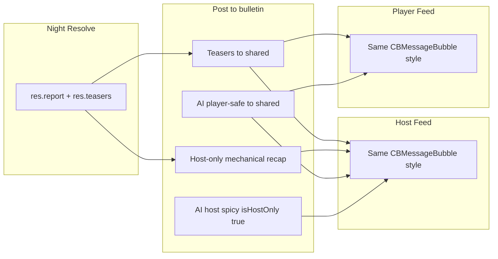

# Day Recap Workshop and Dual-Track Host Display

## Current behavior

- **Night resolution** (`[game_provider.dart](packages/cb_logic/lib/src/game_provider.dart)` ~1650–1679): Produces `res.report` (full truth, e.g. "The Dealers butchered Alice in cold blood") and `res.teasers` (anonymous one-liners). Teasers are posted to the **shared** bulletin as `title: 'NIGHT RECAP'`, so both host and players see the same text.
- **AI narration** (`[host_game_screen.dart](apps/host/lib/screens/host_game_screen.dart)` 44–68): On night→day, host calls `generateDynamicNightNarration()` (using full `lastNightReport` with names/roles) and posts the result to the **shared** bulletin as "AI NARRATOR" — so players currently see whatever the AI outputs (including possible name/role leaks).
- **Host feed** (`[host_main_feed.dart](apps/host/lib/widgets/host_main_feed.dart)`): Renders `bulletinBoard` (including host-only entries) with `CBMessageBubble` for normal/result entries; host-only entries are already supported via `isHostOnly` and are **excluded** when publishing to players in `[cloud_host_bridge.dart](apps/host/lib/cloud_host_bridge.dart)` (`.where((e) => !e.isHostOnly)`).
- **Player feed** (`[game_screen.dart](apps/player/lib/screens/game_screen.dart)` `_buildBulletinList`): Renders bulletin entries as message bubbles; players only receive non–host-only entries from the cloud.

So: the "day recap" is the NIGHT RECAP (and optionally AI NARRATOR) bulletin entries. Goal is to (1) workshop that recap for players, (2) show recap on host in the **same manner** (same feed/bubble style), and (3) give the host a **spicy** version with names/roles that only the host sees.

---

## 1. Dual-track AI night narration (player-safe vs host spicy)

**Problem:** A single AI narration is posted to the shared bulletin and can expose names/roles to players.

**Approach:**

- **Player-safe narration**: New prompt (or explicit instruction in existing flow) that the output is for **players**: no real player names, no role names; dramatic but anonymous (e.g. "A patron fell to the Dealers", "Someone was saved in the shadows"). Post this to the **shared** bulletin (e.g. title "NIGHT RECAP" or "AI NARRATOR") so players and host both see it in the feed.
- **Host spicy narration**: Keep or extend the current prompt for **host only**: full names, roles, heated/R-rated tone. Post as a **host-only** bulletin entry (e.g. title "NIGHT RECAP (HOST)" or "AI NARRATOR — HOST", `isHostOnly: true`) so only the host sees it; cloud already strips these from the payload to players.

**Files:**

- `[packages/cb_logic/lib/src/gemini_narration_service.dart](packages/cb_logic/lib/src/gemini_narration_service.dart)`: Add a parameter (e.g. `forHostOnly: bool`) or a separate method so that:
  - **Player-safe**: prompt states "Output is for players. Do not use real player names or role names. Describe outcomes dramatically but anonymously."
  - **Host-only**: existing prompt (or enhanced) with "Include real names and roles; tone can be spicy/heated/R-rated for host read-aloud."
- `[packages/cb_logic/lib/src/game_controllers/narration_controller.dart](packages/cb_logic/lib/src/game_controllers/narration_controller.dart)`: Expose generation of both versions (e.g. `generateDynamicNightNarration` returns or triggers two calls: one player-safe, one host-only).
- `[packages/cb_logic/lib/src/game_provider.dart](packages/cb_logic/lib/src/game_provider.dart)`: Extend `dispatchBulletin` to accept an optional `isHostOnly` (default false). When posting AI narrations: call dispatch once for player-safe (shared), once for host spicy (`isHostOnly: true`).
- `[apps/host/lib/screens/host_game_screen.dart](apps/host/lib/screens/host_game_screen.dart)` `_triggerNightNarration`: After generating both narrations, post player-safe via `dispatchBulletin(...)`, host spicy via `dispatchBulletin(..., isHostOnly: true)`.

Host feed already renders all bulletin entries (including `isHostOnly`) with the same `CBMessageBubble` style, so the host will see both the shared recap and the spicy recap in the same manner as other messages.

---

## 2. When AI narration is off: host-only mechanical recap

When Gemini is disabled, only teasers are posted (shared). The host currently sees full truth in dashboard panels (e.g. Night Action Intel) but not as a single "recap" block in the feed.

**Approach:** After dispatching teasers in the night→day transition, also post a **host-only** bulletin entry whose content is the full `lastNightReport` (or a short formatted string), e.g. title "NIGHT RECAP (HOST)", `type: 'result'`, `isHostOnly: true`. That way the host sees a recap block in the same feed list, in the same visual style (bubble/card), with names and roles.

**Files:**

- `[packages/cb_logic/lib/src/game_provider.dart](packages/cb_logic/lib/src/game_provider.dart)`: In the `GamePhase.night` branch, after the teaser loop, add a single host-only bulletin entry (content = `res.report` joined or formatted). This requires `dispatchBulletin` to support `isHostOnly` (see above).

---

## 3. Workshop the player-facing recap

- **If AI on:** The "workshopped" player recap is the new **player-safe** AI narration: tune the prompt for length (e.g. 90–160 words), tone (noir, mystery), and strict anonymity. Optional: add a short "NIGHT RECAP" or "DAY RECAP" separator/label in the feed before the first recap entry (both apps) so the block is visually distinct.
- **If AI off:** Keep current teasers; optionally improve copy in resolution handlers (e.g. `[default_death_handler.dart](packages/cb_logic/lib/src/night_actions/resolution/default_death_handler.dart)`, `[medic_revive_handler.dart](packages/cb_logic/lib/src/night_actions/resolution/medic_revive_handler.dart)`) for variety and clarity, without revealing names in teasers (they already don’t).

No change to how or where the recap is rendered on the player app — it remains the bulletin list in `[game_screen.dart](apps/player/lib/screens/game_screen.dart)`; we only change what content is posted (player-safe AI or teasers).

---

## 4. Display parity (host sees recap "in the same manner")

- Host feed already uses the same structure as the player feed for bulletin entries: same `CBMessageBubble`, same ordering by timestamp. No structural change required.
- Optional UX polish on host: for entries with `title` containing "NIGHT RECAP" or "AI NARRATOR", optionally add a small "HOST ONLY" tag (similar to existing ghost/hostIntel tags) when `entry.isHostOnly == true`, so the host can tell at a glance which bubble is the spicy version. Implement in `[host_main_feed.dart](apps/host/lib/widgets/host_main_feed.dart)` in the default bubble branch (e.g. add `CBMiniTag(text: 'HOST ONLY', ...)` when `entry.isHostOnly == true`).

---

## 5. Data and sync

- **BulletinEntry** already has `isHostOnly` (`[packages/cb_models/lib/src/bulletin_entry.dart](packages/cb_models/lib/src/bulletin_entry.dart)`). No model change.
- **Cloud:** Host already filters `bulletinBoard.where((e) => !e.isHostOnly)` when sending to Firestore; player bridge receives only those. No change.
- **GameProvider.dispatchBulletin:** Add optional parameter `bool isHostOnly = false` and pass it into `BulletinEntry`. No change to `gameHistory` for host-only entries if you want to avoid logging spoilers (optional).

---

## Summary diagram

---

## Implementation order

1. **dispatchBulletin(isHostOnly)** — Add `isHostOnly` to `dispatchBulletin` in `game_provider.dart` and use it when creating `BulletinEntry`.
2. **Gemini dual prompts** — In `gemini_narration_service.dart`, support player-safe vs host-only prompt (e.g. `forHostOnly` or two methods). In `narration_controller.dart`, call both and return/post accordingly.
3. **HostGameScreen** — Post player-safe to shared bulletin, host spicy with `isHostOnly: true`.
4. **Mechanical host recap** — In night→day branch, post one host-only entry with `res.report` when AI is not used (or always, so host always has a text recap).
5. **Optional** — Workshop player-safe prompt wording; optional "NIGHT RECAP" separator in both apps; optional "HOST ONLY" tag on host feed for `isHostOnly` recap bubbles.

