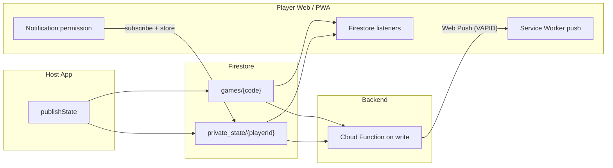

# Host–Player Communication Audit and Push Notifications

## 1. Current State (Audit)

### 1.1 How host and player communicate

- **Cloud mode (Firebase):** Host publishes game state to Firestore; players subscribe via realtime listeners.

| Direction               | Mechanism               | Where                                                                                                                                                                                                                                     |
| ----------------------- | ----------------------- | ----------------------------------------------------------------------------------------------------------------------------------------------------------------------------------------------------------------------------------------- |
| Host → Players          | Firestore writes        | [`cloud_host_bridge.dart`](../../apps/host/lib/cloud_host_bridge.dart): `publishState()` writes to `games/{joinCode}` and `games/{joinCode}/private_state/{playerId}`. |
| Players → Host          | Firestore writes        | [`firebase_bridge.dart`](../../packages/cb_comms/lib/src/firebase_bridge.dart): players write to `games/{joinCode}/actions` and `games/{joinCode}/joins`. |
| Player receives updates | Realtime listeners only | [`cloud_player_bridge.dart`](../../apps/player/lib/cloud_player_bridge.dart): `subscribeToGame().listen()` and `subscribeToPrivateState(playerId).listen()`. |

When the player closes the browser tab or the PWA, those listeners are torn down. State is **not** pushed to the device; the user must reopen the app to see new data.

### 1.2 Gaps (historical — all resolved)

- ~~**No FCM / Web Push:**~~ Web Push via VAPID is now implemented using `package:web` JS interop.
- ~~**No Firebase Cloud Functions:**~~ `functions/index.js` implements the `onGameStateChange` trigger and push-send logic.
- ~~**No stored push targets:**~~ Players register a `PushSubscription` via `CloudPlayerBridge.registerPushSubscription()` which writes to `private_state/{playerId}.pushSubscription`.

### 1.3 Events that trigger a push (catalog)

| Event                              | Who gets notified                    | Rationale                                 |
| ---------------------------------- | ------------------------------------ | ----------------------------------------- |
| Role assigned                      | That player                          | Confirm your role / open app to see role. |
| Game started (phase → setup/night) | All players in game                  | Game is starting.                         |
| Phase → day                        | All living players                   | Day discussion / vote.                    |
| Phase → night                      | Players with a night action (or all) | Your turn / night phase.                  |
| New private bulletin message       | Target player                        | New in-game private message.              |
| Rematch offered                    | All players in that game             | Host started a rematch; rejoin.           |
| Host-only / spicy content          | —                                    | Do **not** push (privacy).                |

---

## 2. Architecture (Push + PWA)



- **Player (web):** Requests notification permission and optionally "Add to Home Screen". Registers a Web Push subscription (VAPID key) and stores it in Firestore under `private_state/{playerId}.pushSubscription`.
- **Backend:** Firebase Cloud Function on `games/{gameCode}` writes detects phase changes and other events, reads subscriptions, and sends via the `web-push` npm package.
- **When app/browser is closed:** `cb-push-sw.js` service worker handles the `push` event and calls `showNotification`. Tapping the notification opens the app URL.

---

## 3. Implementation Status

### 3.1 Audit deliverable — DONE
This document is the audit.

### 3.2 Player: notification permission and PWA install — DONE
- `notifications_prompt_provider.dart` — Riverpod Notifier managing permission state and "asked before" persistence via SharedPreferences.
- `services/push_notification_service.dart` (barrel) + `_stub.dart` + `_web.dart` — conditional-import pattern. Web impl uses `package:web` `Notification.requestPermission()` and captures `beforeinstallprompt` for PWA install.
- `NotificationsPromptBanner` widget shown persistently in `PlayerHomeShell` (above game content) when connected in cloud mode.
- `initPwaInstallListener()` called at startup in `main.dart`.

### 3.3 Player: register and store push subscription — DONE
- `services/push_subscription_register.dart` (barrel) + `_stub.dart` + `_web.dart` — Web impl calls `PushManager.subscribe()` with the VAPID key and serialises the subscription.
- `CloudPlayerBridge.registerPushSubscription()` writes the map to `games/{joinCode}/private_state/{playerId}`.
- `FirebaseBridge.setPushSubscription()` performs the Firestore set.

### 3.4 Service worker: handle push when app is closed — DONE
- `apps/player/web/cb-push-sw.js` handles `push` and `notificationclick` events.
- Registered in `apps/player/web/index.html`.

### 3.5 Backend: Firebase Cloud Function — DONE
- `functions/index.js`:
  - `onGameStateChange` — Firestore `onDocumentWritten` on `games/{gameCode}`. Sends push for all catalogued events (see §1.3).
  - `cleanupStaleGames` — scheduled cleanup every 6 hours.
- `functions/package.json` — `web-push ^3.6.7`, `firebase-admin ^12`, `firebase-functions ^5`.
- `firebase.json` — points at `functions/` source and `apps/player/build/web` for hosting.

### 3.6 Host: no direct sending of push — N/A (by design)
Host only writes to Firestore. Push is triggered by the Cloud Function.

### 3.7 Event coverage

| Event | Implemented | Push tag |
|---|---|---|
| Role assigned (phase → setup) | Yes | `role-assigned` |
| Night phase started | Yes | `night-start` |
| Day/morning phase started | Yes | `day-start` |
| Vote phase started | Yes | `vote-start` |
| Game over (endGame) | Yes | `game-over` |
| New private message (bulletin) | Yes | `private-message` |
| Rematch offered | Yes | `rematch-offered` |

---

## 4. Remaining before production

1. **VAPID keys:** Generate a key pair:
   ```sh
   npx web-push generate-vapid-keys
   ```
   Then set the env vars on the Cloud Function:
   ```sh
   firebase functions:secrets:set VAPID_PUBLIC_KEY
   firebase functions:secrets:set VAPID_PRIVATE_KEY
   firebase functions:secrets:set VAPID_SUBJECT  # e.g. mailto:admin@clubblackout.com
   ```
   Paste the **public key** into `apps/player/lib/services/push_subscription_register_web.dart`:
   ```dart
   const String vapidPublicKeyBase64 = 'YOUR_PUBLIC_KEY_HERE';
   ```

2. **Deploy Cloud Functions:**
   ```sh
   cd functions && npm install
   firebase deploy --only functions
   ```

3. **Deploy player web:**
   ```sh
   cd apps/player && flutter build web --release
   firebase deploy --only hosting
   ```

4. **Test end-to-end:** Permission grant → push subscription stored in Firestore → host triggers phase change → Cloud Function fires → push arrives on closed browser tab → tap opens app.
