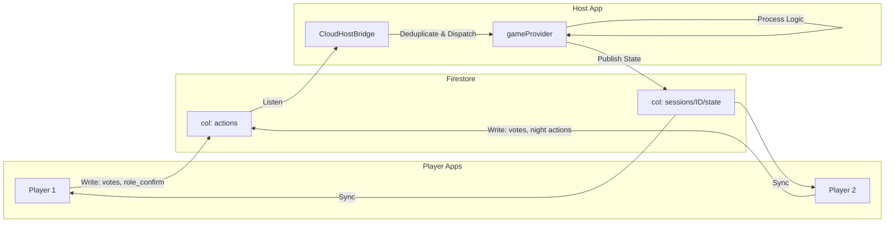

# Host Communication & Override Architecture

This document outlines how the Host App acts as the central hub for all game communication and how the "Host Override" system works.

## 1. Central Hub Architecture

The Host App is the **single source of truth** for game state.

### Data Flow
1.  **Player Action**: Player performs an action (vote, night ability). The Player App writes a document to the `actions` subcollection in Firestore.
2.  **Host Ingestion**: The Host App's `CloudHostBridge` subscribes to `actions`. It validates and deduplicates events.
3.  **Game Logic**: The Host App applies the action to the local `GameState` (via `gameProvider.notifier.handleInteraction()`).
4.  **State Sync**: The Host App publishes the updated `GameState` (public) and private player data back to Firestore.
5.  **Player Update**: Player Apps subscribe to the session document and update their UI.

There is no direct peer-to-peer communication. All state changes flow through the Host.

---

## 2. Host Override System

Since the Host is the central authority, they have "God Mode" capabilities to override any player action or setting.

### Mechanisms

1.  **Day Vote Override**:
    *   **UI**: `VoteTallyPanel` (in `HostMainFeed`) provides a "HOST OVERRIDE" button (gavel icon).
    *   **Function**: Allows the Host to force a vote *from* a specific player *to* a specific target (or clear it/abstain).
    *   **Logic**: Calls `handleInteraction(stepId: 'day_vote_X', voterId: 'PLAYER_ID', targetId: 'TARGET_ID')`. The game logic updates the vote tally immediately as if the player had cast it.

2.  **Night Action Override**:
    *   **UI**: `GameBottomControls` (in `HostMainFeed`) shows a "HOST SELECTION" or "HOST OVERRIDE" panel for the active script step.
    *   **Function**: The Host can select targets for the current step (e.g. Dealer Kill, Medic Save) directly on the dashboard.
    *   **Logic**: Calls `handleInteraction(stepId: 'current_step_id', targetId: 'TARGET_ID')`. This overwrites any previous action for that step.

3.  **Group Settings**:
    *   **UI**: "HOST CONTROL" sheet (via Lobby -> Settings).
    *   **Scope**: Controls audio, narration, and display settings. Future game-rule settings (timers, role pools) will live here.
    *   **Authority**: Host settings are final. Players cannot modify session-level parameters.

## 3. Communication Robustness

*   **Idempotency**: `CloudHostBridge` tracks processed action IDs to prevent duplicate processing if the stream reconnects.
*   **Validation**: The Host validates all incoming actions against the current game phase and rules (e.g. dead players cannot vote unless allowed).
*   **Fallback**: If a player disconnects, the Host can perform their action (Override) to keep the game moving.
