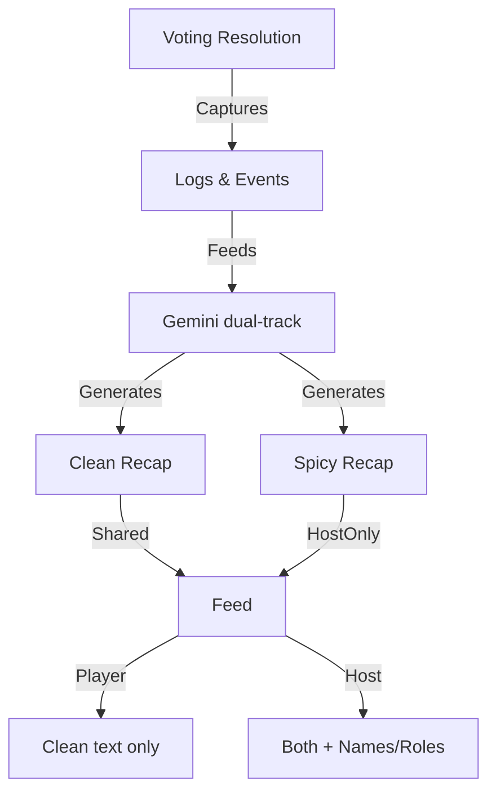

# Robust Voting & Dual-Track Recap Workshop

## 1. Robust Voting Algorithm & Persistent Logging

Currently, votes are tallies but individual "who voted for who" isn't persistently logged in the event stream.

### 1.1 Data Recording in `resolveDayVote`

Modify `[packages/cb_logic/lib/src/game_resolution_logic.dart](packages/cb_logic/lib/src/game_resolution_logic.dart)`:

- Update `resolveDayVote` signature: `static DayResolution resolveDayVote(List<Player> players, Map<String, int> tally, Map<String, String> votesByVoter, int dayCount)`.
- Iterate through `votesByVoter` and add a `GameEvent.vote` for each.
- Add descriptive strings to the returned `report` for each vote (e.g., "Alice cast a vote against Bob").

### 1.2 Retaliation & Shenanigans

Ensure `Predator`, `Tea Spiller`, and `Drama Queen` roles have easy access to this data via the `eventLog` or a dedicated `votingHistory` if needed. (Current implementation uses `dayVotesSnapshot` which is good for the immediate retaliation, but `eventLog` will make it permanent for stats).

### 1.3 Host Accessibility

Modify `[apps/host/lib/widgets/host_main_feed.dart](apps/host/lib/widgets/host_main_feed.dart)`:

- When rendering `hostIntel` or `result` entries related to voting, ensure they show the breakdown if the host asks (or just post them as a host-only block).

---

## 2. Dual-Track Night Recap Workshop

### 2.1 Prompt Tuning for "Clean" vs "Spicy"

Modify `[packages/cb_logic/lib/src/gemini_narration_service.dart](packages/cb_logic/lib/src/gemini_narration_service.dart)`:

- Create `_buildPlayerNightPrompt` (Clean): Anonymous, dramatic, noir tone.
- Create `_buildHostNightPrompt` (Spicy): Names, roles, "antagonizing" instructions.

**Spicy Terminology Guidelines:**

- Use phrases like: "absolute clown show", "bottled it in the VIP", "neon-soaked catastrophe", "spectacularly poor life choice", "the Dealers are laughing at you".
- Instructions for self-deprecating host humor: "I've seen better deductive reasoning from a broken jukebox".

### 2.2 Orchestration in `NarrationController`

Modify `[packages/cb_logic/lib/src/game_controllers/narration_controller.dart](packages/cb_logic/lib/src/game_controllers/narration_controller.dart)`:

- `generateDynamicNightNarration` should now return a `Map<String, String>` or similar containing `{'player': cleanText, 'host': spicyText}`.

### 2.3 Dispatching to Bulletin

Modify `[apps/host/lib/screens/host_game_screen.dart](apps/host/lib/screens/host_game_screen.dart)`:

- Dispatch the clean version to the shared bulletin.
- Dispatch the spicy version with `isHostOnly: true` and title `AI NARRATOR (SPICY)`.

---

## 3. UI Implementation for Host Recap Display

Modify `[apps/host/lib/widgets/host_main_feed.dart](apps/host/lib/widgets/host_main_feed.dart)`:

- Ensure `CBMessageBubble` for `isHostOnly` entries (like the spicy recap) has a distinct visual indicator (e.g., a "HOST ONLY" or "SPICY" tag).

## Summary diagram

## Implementation order

1. **Voting Data**: Update `resolveDayVote` and `game_provider` to record individual votes in `eventLog` and `gameHistory`.
2. **Prompt Engineering**: Add "Clean" vs "Spicy" logic and terminology guide to `GeminiNarrationService`.
3. **Controller Update**: Modify `NarrationController` to produce both versions.
4. **Host Screen Integration**: Update `_triggerNightNarration` to dispatch both.
5. **Host Feed Polish**: Add "SPICY" tag to host-only recap bubbles.

