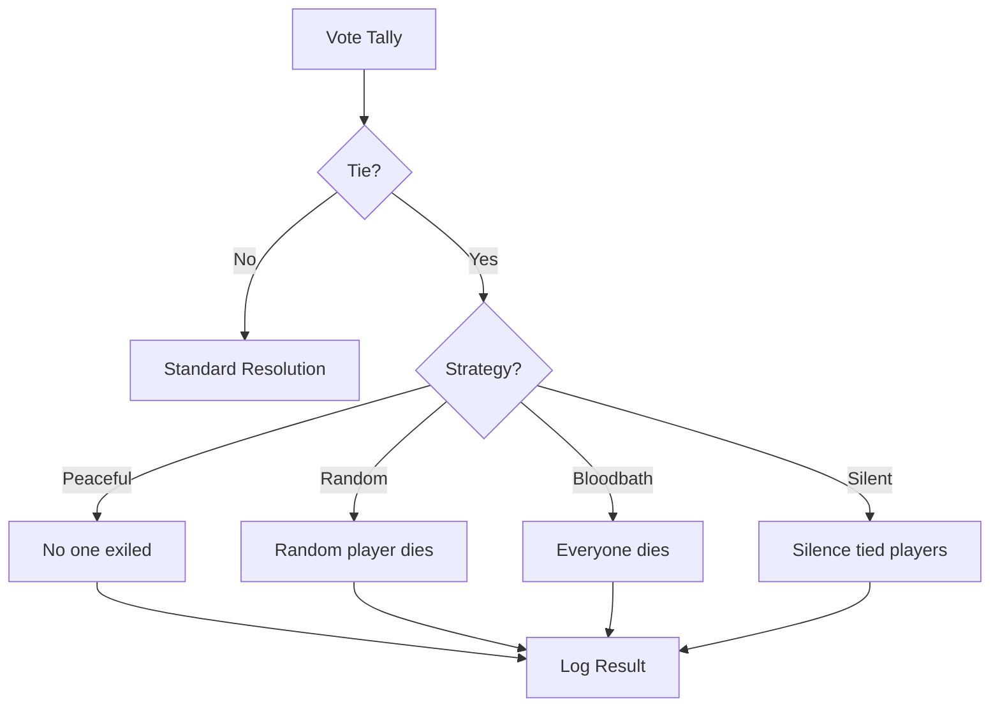

# Tie-Break Workshop and Implementation

## 1. Proposed Tie-Break Strategies

I suggest moving from a binary "Random/No Exile" toggle to a `TieBreakStrategy` enum with the following options:

1.  **PEACEFUL (NO EXILE)**: Current default. If there's a tie, no one is exiled. High survival, slower game pace.
2.  **CHAOTIC (RANDOM)**: A random player from the tied group is exiled. High stakes, unpredictable.
3.  **BLOODBATH**: Everyone involved in the tie is exiled. Extremely high stakes, speeds up the game significantly.
4.  **DEALER'S MERCY**: If a Dealer voted for one of the tied players, that player is exiled (Dealer has tie-breaking power). If not, falls back to Peaceful.
5.  **SILENT TREATMENT (SHENANIGAN)**: No one is exiled, but everyone in the tie is "Silenced" (cannot speak or vote) for the next Day.

---

## 2. Implementation Plan

### 2.1 Model Updates
Modify [`packages/cb_models/lib/src/game_state.dart`](packages/cb_models/lib/src/game_state.dart):
-   Add `enum TieBreakStrategy { peaceful, random, bloodbath, dealerMercy, silentTreatment }`.
-   Replace `@Default(false) bool tieBreaksRandomly` with `@Default(TieBreakStrategy.peaceful) TieBreakStrategy tieBreakStrategy`.
-   Run `dart run build_runner build`.

### 2.2 Logic Updates
Modify [`packages/cb_logic/lib/src/game_resolution_logic.dart`](packages/cb_logic/lib/src/game_resolution_logic.dart):
-   Update `resolveDayVote` to accept `TieBreakStrategy strategy`.
-   Implement the logic for each strategy when a tie is detected.
-   Ensure all outcomes (including multiple deaths in Bloodbath) are added to the `events` list and `report`.

Modify [`packages/cb_logic/lib/src/game_provider.dart`](packages/cb_logic/lib/src/game_provider.dart):
-   Update `setTieBreak` to `setTieBreakStrategy(TieBreakStrategy strategy)`.
-   Pass the new strategy into `GameResolutionLogic.resolveDayVote`.

### 2.3 Host UI Updates
Modify [`apps/host/lib/widgets/dashboard/quick_settings_panel.dart`](apps/host/lib/widgets/dashboard/quick_settings_panel.dart):
-   Update the "TIE BREAK" row to open a picker/modal allowing the host to select between the new strategies.

### 2.4 Persistent Logging & Stats
-   Ensure every tie-break outcome is logged as a `GameEvent` with a new `type` if necessary (e.g., `tieBreakOutcome`), or just multiple `death` events for Bloodbath.
-   Update `gameHistory` with flavor text (e.g., "The club descended into a BLOODBATH! 3 patrons were kicked out.").

---

## Summary diagram

## Implementation order

1.  **Define Enum**: Add `TieBreakStrategy` to models.
2.  **Update Logic**: Implement strategies in `GameResolutionLogic`.
3.  **Update Provider**: Wire the new strategy into the game loop.
4.  **Host UI**: Create the selection modal in the Host app.
5.  **Flavor Text**: Add spicy terminology for tie-break outcomes in the recap.
